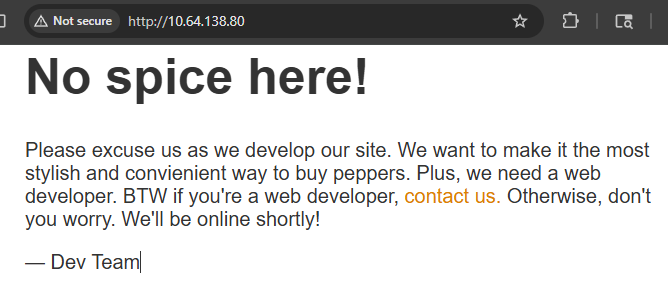

# [TryHackMe - Startup](https://tryhackme.com/room/startup)
- Author: [Thomas Cooke](http://github.com/tomrobertcooke)
<br>

## Challenge description:

> **Difficulty:** Easy<br>
> **Points:** 90<br>
> **Time Estimate:** 45 minutes<br>
> **Assignment:**
> *Spice Hut* has assigned me with conducting a penetration test to try to own root, citing rising security concerns and a lack of confidence in their web developers. They requested that I find 3 flags.<br>
> **Flag 1:** What is the *secret spicy soup recipe?*<br>
> **Flag 2:** What are the contents of `user.txt`?<br>
> **Flag 3:** What are the contents of `root.txt`?<br>

<br>


## Enumeration

I started out by just visiting their site in a web browser.



At first glance, they're just hosting a website with a temporary homepage. There isn't much information to gather there even after looking at the source code.

```html
<!doctype html>
<title>Maintenance</title>
<style>
  body { text-align: center; padding: 150px; }
  h1 { font-size: 50px; }
  body { font: 20px Helvetica, sans-serif; color: #333; }
  article { display: block; text-align: left; width: 650px; margin: 0 auto; }
  a { color: #dc8100; text-decoration: none; }
  a:hover { color: #333; text-decoration: none; }
</style>

<article>
    <h1>No spice here!</h1>
    <div>
	<!--when are we gonna update this??-->
        <p>Please excuse us as we develop our site. We want to make it the most stylish and convienient way to buy peppers. Plus, we need a web developer. BTW if you're a web developer, <a href="mailto:#">contact us.</a> Otherwise, don't you worry. We'll be online shortly!</p>
        <p>&mdash; Dev Team</p>
    </div>
</article>
```

From there I started enumerating open ports and services with `nmap`.


`FTP anon: Anonymous FTP login allowed` seemed very promising, especially combined with the writeable directory `ftp`.

Now that I had a way to upload files onto their network, I wanted to see if there was any chance of running a web shell. I tried a few different urls looking for directory traversal, but wasn't getting anywhere, so I decided to run it through `dirb`.

 

The `files` directory being listable made this very easy to check if I could reach the `ftp` folder.


All I had to do at this point was get a web shell, like PentestMonkey's [PHP Reverse Shell](), and upload it to the `files/ftp folder` with anonymous login. Then all I had to do was listen for it with `nc -lnvp <PORT>`, and `curl http://<TARGET-IP-ADDRESS>/files/ftp/shell.php` to send it out.

[]